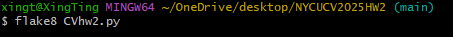

# NYCUCV2025HW2

<p>Student ID: 111550029</p>
<p>Name: 蔡奕庠</p>

## Introduction 

This project implements a visual recognition system for digit identification using the Faster R-CNN architecture. The system is capable of detecting digits within images and recognizing complete digit sequences. It consists of two main tasks:

1. **Task 1**: Detect the class and bounding box of each digit in the image.  
2. **Task 2**: Assemble a complete digit sequence based on the detected digits.

## How to install
Follow these steps to set up and run the project:

### 1. Clone the repository
```bash
git clone https://github.com/xingting1026/NYCUCV2025HW2.git
cd your-repo
```

### 2. Create a virtual environment
```bash
conda create --name my_env python=3.10
conda activate my_env
```
### 3. Install dependencies
```bash
pip install -r requirements.txt
```

### 4. Set up your dataset
```bash
project_root/
│── data/
│   ├── train/
│   ├── valid/
│   ├── test/
│   ├── train.json
│   └── valid.json
│── CVhw2.py
```
### 5. Run the main script
```bash
python CVhw2.py
```
## Performance snapshot

